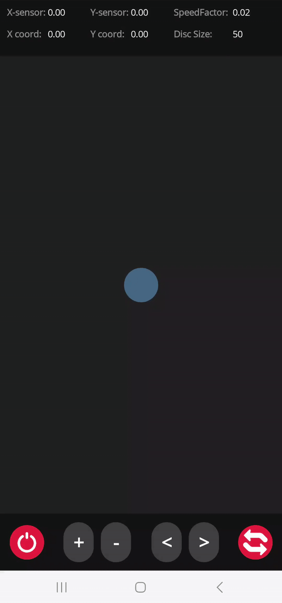

# UI Controls Experiment

**Branch:** `experiment/ui-controls`  
**Status:** Completed Experiment / Demo  

This experiment explores **sensor-based manipulation of on-screen objects** using .NET MAUI. It demonstrates how UI controls can interact with accelerometer input to adjust object behavior in real-time.

---

## Features

- Increase / decrease object speed using UI buttons  
- Increase / decrease object size based on sensor input  
- Toggle sensor ON / OFF  
- Toggle X/Y axis inversion for sensor input  

> All functionality has been implemented and tested on a physical device*.  
> *tested only on Andorid platform

---

## UI Demo (GIFs)

<p float="left">
  
  
  
</p>


## Build & Run Instructions

 > **Recommended (Visual Studio):** Open the solution in Visual Studio → Connect an mobile device → Build & Deploy  
  

Follow these steps to compile, run, and deploy the application using the **.NET CLI**.

### 1. Prerequisites

Before starting, ensure all required MAUI workloads and dependencies are installed.
Run this command in the project root:

```bash
dotnet workload restore
```

---

### 2. Run on Device (Debug)

To build the app and immediately deploy it to a connected Android device via USB:

> **Note:** Ensure USB Debugging is enabled on your Android device.

```bash
dotnet build -t:Run -f net8.0-android
```

---

### 3. Build APK (Release)

To generate a standalone installation file (`.apk`) for manual installation or distribution:

```bash
dotnet publish -f net8.0-android -c Release
```

---

#### 3.1 Output Location

After a successful release build, the APK file can be found in the following directory:

```
bin/Release/net8.0-android/publish/
```

---


