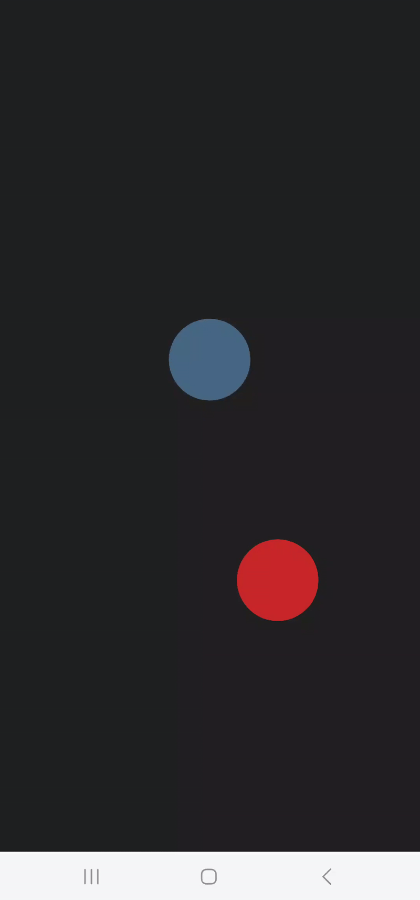

# Tilting Game Experiment

**Branch:** `experiment/tilting-game`  
**Status:** Paused – Prototype  
*(Creating game in .NET MAUI is a large-bite (e.g Implementing Collision-resolving from scratch)*

This experiment explores a **tilt-controlled game mechanics** using the device accelerometer in **.NET MAUI**.  
The goal is to demonstrate how **device orientation (tilting)** with **Collision-physics** can directly control in-game object movement in real time.

---

## Features

- fixed object with model-behind attributes
- collision-detection functionalities
- resolving collision (deadzone and with fixed object)

> All functionality has been implemented and tested on a physical device*.  
> *tested only on Android platform

---

## Gameplay Demo (GIFs)

  


---

## Build & Run Instructions

> **Recommended (Visual Studio):**  
> Open the solution in **Visual Studio** → Connect a mobile device → **Build & Deploy**

Follow these steps to compile, run, and deploy the application using the **.NET CLI**.

---

### 1. Prerequisites

Before starting, ensure all required MAUI workloads and dependencies are installed.  
Run this command in the project root:

```bash
dotnet workload restore
````

---

### 2. Run on Device (Debug)

To build the app and immediately deploy it to a connected Android device via USB:

> **Note:** Ensure USB Debugging is enabled on your Android device.

```bash
dotnet build -t:Run -f net8.0-android
```

---

### 3. Build APK (Release)

To generate a standalone installation file (`.apk`) for manual installation or distribution:

```bash
dotnet publish -f net8.0-android -c Release
```

---

#### 3.1 Output Location

After a successful release build, the APK file can be found in the following directory:

```
bin/Release/net8.0-android/publish/
```

